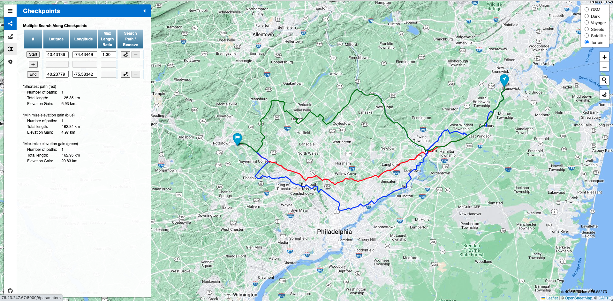

# Elevation based Navigation System (EleNa)
Navigation systems optimize for the shortest or fastest route. However, they do not consider elevation gain. Let’s say you are hiking or biking from one location to another. You may want to literally go the extra mile if that saves you a couple thousand feet in elevation gain. Likewise, you may want to maximize elevation gain if you are looking for an intense yet time-constrained workout.

This repository introduces a navigation system that maximizes or minimizes elevation gain within x% of the shortest path.

<a href="https://github.com/dlim2012/elevation-based-navigation-system/tree/main/samples">(More screenshots)</a>

## Used Sources
### Database
-Road Data:
<a href="https://www.openstreetmap.org/"> OpenStreetMap</a>,
<a href="https://github.com/Jorl17/open-elevation">Open-Elevation</a>,
<a href="https://giscience.github.io/openrouteservice/documentation/Tag-Filtering.html">Tag Filtering</a> (Note: <a href="https://wiki.openstreetmap.org/wiki/Key:sac_scale">demanding/difficult alpine hiking</a> routes excluded) 
-Database:
<a href="https://osm2pgsql.org/">OSM2PGSQL</a>,
<a href="https://www.postgresql.org/">PostgreSQL</a> (v15) with
<a href="https://postgis.net/">PostGIS extension</a> (v3.3) 
### Backend
-Language: C++17  
-Dependencies:
<a href="https://pqxx.org/libpqxx/">Libpqxx</a> (v6.4.5),
<a href="https://crowcpp.org/master/">Crowcpp</a> (v1.0+5 Security Patch),
<a href="https://github.com/elnormous/HTTPRequest">HTTPRequest</a>,
<a href="https://www.boost.org/">Boost Libraries</a> (v1.81.0)  
### Frontend
-Languages and Packages: HTML5, JavaScript,
<a href="https://leafletjs.com/reference.html#icontrol">Leaflet</a>,
<a href="https://fontawesome.com/">Font Awesome</a> 
-Leaflet plugins:
<a href="https://github.com/CliffCloud/Leaflet.EasyButton">L.EasyButton</a>,
<a href="https://github.com/lennardv2/Leaflet.awesome-markers">Leaflet.Awesome-Markers</a>,
<a href="https://github.com/noerw/leaflet-sidebar-v2">leaflet-sidebar-v2</a>,
<a href="https://github.com/aratcliffe/Leaflet.contextmenu">Leaflet.contextmenu</a>,
<a href="https://github.com/adoroszlai/leaflet-distance-markers">leaflet-distance-markers</a>,
<a href="https://github.com/perliedman/leaflet-control-geocoder">Control.GeoCoder</a> 
-Tile layers:
OpenStreetMap default,
<a href="https://carto.com/basemaps/">Carto maps</a>,
<a href="https://developers.google.com/maps/documentation/tile">Google maps</a> 

## Algorithms
- Tarjan's strongly connected graph
- BallTree algorithm: search nearest node, search two random near node
- Dijkstra's algorithm
- Genetic algorithm for elevation minimization
- Genetic algorithm for elevation maximization

## Frontend
### User Interface
- Buttons on map: Tile layer switch, Zoom in/out, Location search by text 
- Mouse on map: Marker dragging, show coordinates (right bottom)  
- Context menu (right click): set start marker here, set end marker here, add checkpoint here, remove checkpoint, etc  
- Sidebar:
  - Project introduction
  - Checkpoint table: add/remove checkpoints, locate each checkpoints, search path individually, set coordinates, set max length ratio
  - GitHub link
  - Various settings

### Settings
* Transportation type: (select one)
    * Hiking
    * Cycling
    * Cycling with road restrictions
* Paths to show:
    * Shortest path
    * Minimize elevation gain
    * Maximize elevation gain
* Target computation time: (select one)
    * Default
    * 2, 5, 15, 30, 60, 120 seconds
* Duplicate edge policy between two locations: (select one)
    * Allow duplicate edges
    * Minimize duplicate directed edges
    * Minimize duplicate edges
* Automatic path search on:
    * Marker drag
    * Marker remove
    * Show path checkbox
* Checkpoint table change marker order: (select one)
    * Drag and drop
    * Drag and switch
* Max Length Ratio:
    - Use same value for each checkpoint
* Recalculate path:
    - Allow recalculating path searches
* Show distance:
    - Show distance marker along the path

