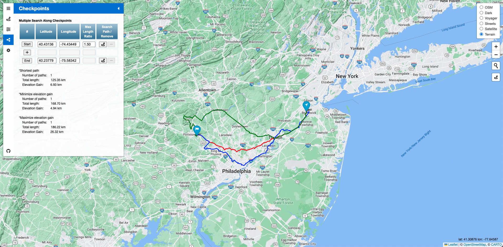

# Elevation based Navigation System (EleNa)

A navigation system that maximizes or minimizes elevation gain within x% of the shortest path.

  

## Used Sources
### Database
-Road Data:
    <a href="https://www.openstreetmap.org/"> OpenStreetMap</a>,
    <a href="https://github.com/Jorl17/open-elevation">Open-Elevation</a>,
    <a href="https://giscience.github.io/openrouteservice/documentation/Tag-Filtering.html">Tag Filtering</a> 
-Database:
    <a href="https://osm2pgsql.org/">OSM2PGSQL</a>,
    <a href="https://www.postgresql.org/">PostgreSQL</a> v15 with
        <a href="https://postgis.net/">PostGIS extension</a> 
### Backend
-Language: C++17  
-Dependencies:
    <a href="https://pqxx.org/libpqxx/">Libpqxx</a> (6.4.5),
    <a href="https://crowcpp.org/master/">Crowcpp</a> (v1.0+5 Security Patch),
    <a href="https://github.com/elnormous/HTTPRequest">HTTPRequest</a>,
    <a href="https://www.boost.org/">Boost Libraries</a> (version 1.81.0)  
### Frontend
-Languages and Packages: HTML5, JavaScript,
    <a href="https://leafletjs.com/reference.html#icontrol">Leaflet</a>,
    <a href="https://fontawesome.com/">Font Awesome</a> 
-Leaflet plugins:
    <a href="https://github.com/CliffCloud/Leaflet.EasyButton">L.EasyButton</a>,
    <a href="https://github.com/lennardv2/Leaflet.awesome-markers">Leaflet.Awesome-Markers</a>,
    <a href="https://github.com/noerw/leaflet-sidebar-v2">leaflet-sidebar-v2</a>,
    <a href="https://github.com/aratcliffe/Leaflet.contextmenu">Leaflet.contextmenu</a>,
    <a href="https://github.com/adoroszlai/leaflet-distance-markers">leaflet-distance-markers</a>,
    <a href="https://github.com/perliedman/leaflet-control-geocoder">Control.GeoCoder</a> 
-Tile layers:
    OpenStreetMap default,
    <a href="https://carto.com/basemaps/">Carto maps</a>,
    <a href="https://developers.google.com/maps/documentation/tile">Google maps</a> 

